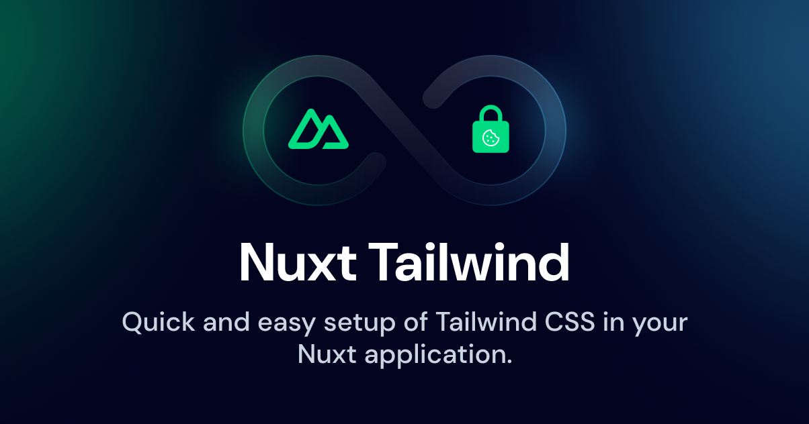

# 🍪 nuxt-simple-cookie-consent

[![npm version][npm-version-src]][npm-version-href]
[![npm downloads][npm-downloads-src]][npm-downloads-href]
[![License][license-src]][license-href]
[![Nuxt][nuxt-src]][nuxt-href]



A simple, headless, and fully customizable cookie consent module for Nuxt 3.  
Built for developers who want full control over styling and behavior, without relying on bloated third-party libraries.

[See the example in the playground](./playground) (uses Nuxt UI)

## 🚀 Features

<!-- Highlight some of the features your module provide here -->
- ✅ **Headless design** – Full control over all UI/UX. The module only provides logic and script handling.
- ✅ **Group scripts into multiple categories** – Organize by purpose (e.g., `analytics`, `ads`, or both).
- ✅ **Required categories** – Mark categories as `required: true` to always enable them and prevent opt-out.
- ✅ **Reactive `useCookieConsent()` composable** – Easily track consent preferences, expiration, and control flow in your app.
- ✅ **Auto-injection and removal of scripts** – Scripts are dynamically injected or removed based on real-time user preferences.
- ✅ **Support for multi-category scripts** – A script can belong to multiple categories (e.g., both `ads` and `analytics`).
- ✅ **Consent expiration** – Automatically expire and re-prompt user consent after a configured number of days.
- ✅ **Consent versioning** – Force a new prompt if your policy has changed (version mismatch).
- ✅ **SSR-safe script control** – Scripts are only injected client-side using `import.meta.client`, avoiding SSR issues.
- ✅ **Post-load callbacks** – Easily initialize tools like Google Tag Manager or Facebook Pixel after consent is given.
- ✅ **Inline & pixel tag support** – Supports `<script>`, `<iframe>`, or custom HTML as part of your cookie configuration.
- ✅ **Event lifecycle hooks** – Listen to key events like:
  - `onConsentAccepted`
  - `onConsentDenied`
  - `onCategoryAccepted(category)`
  - `onScriptsInjected(category)`
  - `onScriptsRemoved(category)`
- ✅ **Built-in dev helpers** – Debug logging, timestamp tracking, `resetPreferences()` and more.

## 📦 Installation

Install the module to your Nuxt application with one command:

```bash
npm install nuxt-simple-cookie-consent
```

That's it! You can now use nuxt-simple-cookie-consent in your Nuxt app ✨

```ts
export default defineNuxtConfig({
  modules: ['nuxt-simple-cookie-consent'],
  cookieConsent: {
    expiresInDays: 180,
    consentVersion: '1.0.0',
    cookieName: 'cookie_consent',
    categories: {
      analytics: {
        label: 'Analytics',
        description: 'Used to improve website performance.',
        required: false,
      },
      ads: {
        label: 'Advertisement',
        description: 'Used for ad personalization.',
      },
    },
    scripts: [
      {
        id: 'ga2',
        src: 'https://www.googletagmanager.com/gtag/js?id=GA_ID',
        async: true,
        defer: true,
        categories: ['analytics', 'ads'],
      },
      {
        id: 'ads',
        src: 'https://ads.example.com/script.js',
        categories: ['ads'],
      },
      {
        id: 'ga',
        src: 'https://www.googletagmanager.com/gtag/js?id=GA_ID',
        customContent: `
          window.dataLayer = window.dataLayer || [];
          function gtag(){dataLayer.push(arguments);}
          gtag('js', new Date());
          gtag('config', 'GA_ID');
        `,
        categories: ['analytics'],
      },
      {
        id: 'facebook',
        customHTML: `
            <iframe src="https://www.facebook.com/tr?id=FB_PIXEL_ID&ev=PageView&noscript=1"
                    height="1" width="1" style="display:none"></iframe>
          `,
        categories: ['ads'],
        src: '',
      },
    ],
  },
})
```

## Usage

Use the built-in composable to build your own cookie banner, modal, or settings panel:

```ts
const {
  preferences,
  categoryMeta,
  updatePreferences,
  acceptAll,
  denyAll,
  acceptCategories,
  hasUserMadeChoice
} = useCookieConsent()
```

Build your UI using Nuxt UI, Tailwind, or anything else.  
Preferences are fully reactive and changes are immediately reflected.
You can find example in the playground with Nuxt UI!

## 📌 Why Another Cookie Module?

Other modules are:

- ❌ Too opinionated on UI
- ❌ Too complex to configure
- ❌ Not reactive or dynamic enough

This one gives you **just the logic** — you handle the rest with your own design system and UX.
Well, of course you will get a full working examples, no need to pressure yourself!

## 🛠 Planned Features
- [x] Support multiple categories
- [x] Script injection/removal based on category
- [x] Post-load callbacks
- [x] Required categories (`required: true`)
- [x] Consent expiration / auto-renew prompt
- [x] DevTools integration
- [x] Built-in helpers for common script types
- [x] SSR-safe inline script support
- [x] Events (`onConsentAccepted, onConsentDenied, onCategoryAccepted, onScriptsInjected, onScriptsRemoved`)
- [x] Consent Versioning

## 🙏 Contributing

Pull requests, issues, and suggestions are welcome!

If you find a bug or want to propose a feature, open an issue or a PR.

<details>
  <summary>Local development</summary>
  
  ```bash
  # Install dependencies
  npm install
  
  # Generate type stubs
  npm run dev:prepare
  
  # Develop with the playground
  npm run dev
  
  # Build the playground
  npm run dev:build
  
  # Run ESLint
  npm run lint
  
  # Run Vitest
  npm run test
  npm run test:watch
  
  # Release new version
  npm run release
  ```

</details>


<!-- Badges -->
[npm-version-src]: https://img.shields.io/npm/v/nuxt-simple-cookie-consent/latest.svg?style=flat&colorA=020420&colorB=00DC82
[npm-version-href]: https://npmjs.com/package/nuxt-simple-cookie-consent

[npm-downloads-src]: https://img.shields.io/npm/dm/nuxt-simple-cookie-consent.svg?style=flat&colorA=020420&colorB=00DC82
[npm-downloads-href]: https://npm.chart.dev/nuxt-simple-cookie-consent

[license-src]: https://img.shields.io/npm/l/nuxt-simple-cookie-consent.svg?style=flat&colorA=020420&colorB=00DC82
[license-href]: https://npmjs.com/package/nuxt-simple-cookie-consent

[nuxt-src]: https://img.shields.io/badge/Nuxt-020420?logo=nuxt.js
[nuxt-href]: https://nuxt.com
